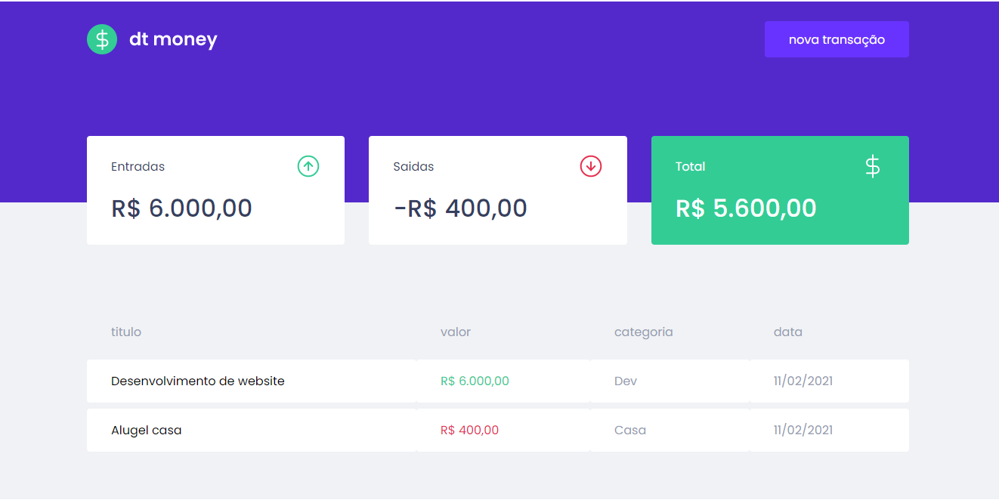

<p align="center">
  
</p>
<p align="center">
  
</p>

### 🎉 Figma | Design 

https://www.figma.com/file/0xmu9mj2TJYoIOubBFWsk5/dtmoney-Ignite-(Copy)?node-id=0%3A1

### 🙌 Pré-requisitos

Antes de começar, você vai precisar ter instalado em sua máquina as seguintes ferramentas:
[Git](https://git-scm.com), [Node.js](https://nodejs.org/en/) e [Yarn](https://yarnpkg.com/). 
Além disto é bom ter um editor para trabalhar com o código como [VSCode](https://code.visualstudio.com/)

### 🎲 Rodando o Front end
```bash
# Clone este repositório
$ git clone | # clonar este projeto

# Acesse a pasta do projeto no terminal/cmd
$ cd dt-money

# Instale as dependências
$ yarn

# Execute a aplicação em modo de desenvolvimento
$ yarn start

# O servidor inciará na porta:3000 - acesse http://localhost:3000
```
